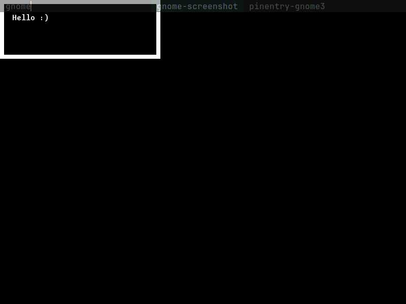

#Undertale fangame Engine

It is suposed to be a game engine for Undertale fangames with a lot of usefull features for making any kind of game with undertale estetics.

It wouldn't have features for making battles easyly, yet, but it will have all the tools to make them.

It is only for linux and it is compiled with ` ./make clean build run ` or runed with ` ./make run `.
